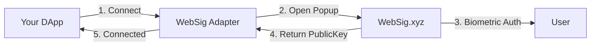

# WebSig Wallet Adapter

<div align="center">
  
  <h3>The Future of Web3 Authentication</h3>
  <p>No extensions. No seed phrases. Just your biometrics.</p>
</div>

---

## ✨ Features

- 🔐 **Biometric Authentication** - Use Face ID, Touch ID, or Windows Hello
- 🌐 **No Extension Required** - Works in any browser, on any device
- 🚀 **Instant Integration** - One line of code for existing Solana DApps
- 📱 **Mobile First** - Beautiful experience on phones and tablets
- 🎨 **Beautiful UI** - Porto-inspired minimal design

## 🚀 Installation

```bash
npm install @websig/wallet-adapter
```

or

```bash
yarn add @websig/wallet-adapter
```

## 💻 Usage

### With React (Recommended)

If you're using `@solana/wallet-adapter-react`:

```tsx
import { WalletProvider } from '@solana/wallet-adapter-react';
import { WalletModalProvider } from '@solana/wallet-adapter-react-ui';
import { WebSigWalletAdapter } from '@websig/wallet-adapter';

function App() {
  const wallets = [
    new WebSigWalletAdapter(),
    // ... other wallets
  ];

  return (
    <WalletProvider wallets={wallets}>
      <WalletModalProvider>
        {/* WebSig now appears in the wallet list! */}
        <YourApp />
      </WalletModalProvider>
    </WalletProvider>
  );
}
```

### Direct Usage

```typescript
import { WebSigWalletAdapter } from '@websig/wallet-adapter';

const wallet = new WebSigWalletAdapter();

// Connect
await wallet.connect();
console.log('Connected:', wallet.publicKey?.toString());

// Sign transaction
const signature = await wallet.signTransaction(transaction);

// Sign message
const sig = await wallet.signMessage(new TextEncoder().encode('Hello WebSig!'));

// Disconnect
await wallet.disconnect();
```

## 🎨 How It Looks

When users click "WebSig" in your wallet list:

1. **Beautiful popup opens** (or new tab on mobile)
2. **User authenticates with biometrics**
3. **Connected!** No seed phrases, no passwords

<div align="center">
  
</div>

## 🤝 Compatibility

WebSig works with all standard Solana wallet adapters:

- ✅ `@solana/wallet-adapter-react`
- ✅ `@solana/wallet-adapter-react-ui`
- ✅ `@solana/wallet-adapter-base`
- ✅ Jupiter
- ✅ Raydium
- ✅ Magic Eden
- ✅ Any DApp using standard wallet adapters

## 🔧 Configuration

### Custom WebSig URL (for development)

```typescript
// Set environment variable
NEXT_PUBLIC_WEBSIG_URL=http://localhost:3000

// Or configure directly
const wallet = new WebSigWalletAdapter({
  url: 'http://localhost:3000'
});
```

## 🏗️ Architecture



## 📦 What's Included

- `WebSigWalletAdapter` - Main adapter class
- TypeScript definitions
- Beautiful WebSig icon
- Zero dependencies (except peer deps)
- < 10KB minified

## 🛠️ Development

```bash
# Clone the repo
git clone https://github.com/websig-xyz/websig-wallet-adapter
cd websig-wallet-adapter

# Install dependencies
npm install

# Build
npm run build

# Watch mode
npm run dev
```

## 📝 Examples

Check out the `/examples` folder for:
- Next.js integration
- Plain React
- Vue.js
- Vanilla JavaScript

## 🔗 Links

- [WebSig Website](https://websig.xyz)
- [Documentation](https://docs.websig.xyz)
- [GitHub](https://github.com/websig-xyz/websig-wallet-adapter)
- [Twitter](https://twitter.com/websig_xyz)

## 📄 License

Apache 2.0 - See [LICENSE](LICENSE) file for details

## 🎮 Live Examples

We have **fully functional examples** ready to test:

### 📄 Vanilla JavaScript
Open `examples/vanilla.html` directly in your browser. No build step required!

Features:
- Connect/disconnect wallet
- Sign messages & transactions  
- Display balance
- Environment switcher

### ⚛️ React Application
```bash
cd examples/react
npm install
npm run dev
```

A complete React app with:
- Full wallet adapter integration
- Beautiful wallet modal UI
- Send transactions
- Sign messages

Both examples work with:
- **Production**: https://websig.xyz (default)
- **Local Development**: http://localhost:3001

[📖 See examples/README.md for detailed instructions](./examples/README.md)

## 🤔 FAQ

**Q: Do users need to install anything?**  
A: No! WebSig is a web app. Clicking "Connect" opens websig.xyz in a popup.

**Q: How secure is it?**  
A: Very. Biometric authentication + hardware security + zero-knowledge architecture.

**Q: Does it work on mobile?**  
A: Yes! Opens in a new tab on mobile with seamless return flow.

**Q: Can I use it with existing wallet adapters?**  
A: Yes! WebSig is fully compatible with Solana wallet standards.

---

<div align="center">
  <p>Built with ❤️ by the WebSig team</p>
  <p>Making Web3 accessible to everyone</p>
</div>
